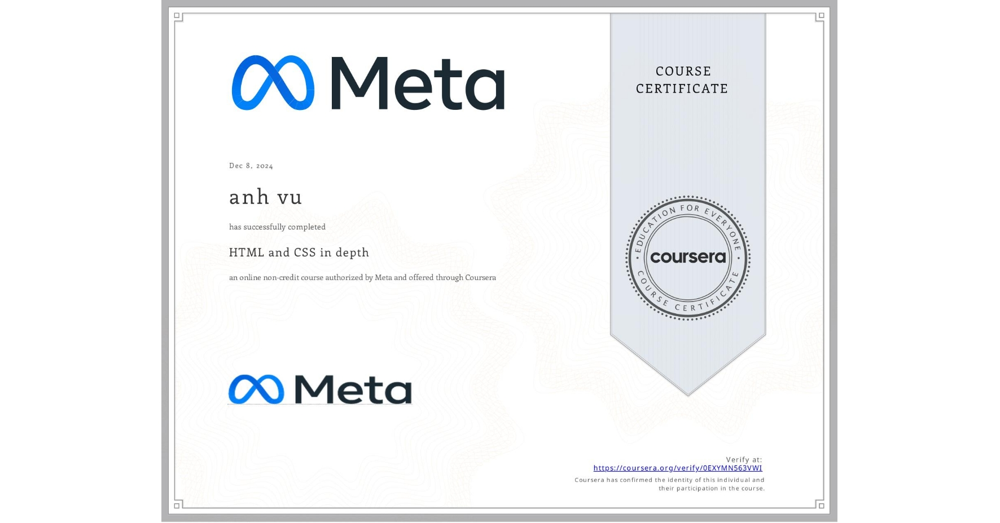

<h1 align="center">Hi there 👋, I'm Trung Anh</h1>

Independence – Freedom – Happiness

<h3 align="center">Experienced with Full Stack Java Development, Tools Making and Automation Testing</h3>

<h4 align="center">Java Developer with vast area of hands-on experience designing, developing, and implementing applications and solutions using a range of technologies and programming languages with IT fundamentals. Seeking to leverage broad development experience and hands-on technical expertise in a challenging role as a Java Developer</h4>

<!-- **trunganhvu/trunganhvu** is a ✨ _special_ ✨ repository because its `README.md` (this file) appears on your GitHub profile.

Here are some ideas to get you started:

- 🔭 Please have a look to my Digital Protfolio : https://trunganhvu.github.io/cvweb/
- 🌱 I’m currently learning ...
- 👯 I’m looking to collaborate on ...
- 🤔 I’m looking for help with ...
- 💬 How to reach me on LinkedIn : https://www.linkedin.com/in/trung-anh-836101188/
- 📫 How to reach me: ...
- 😄 Pronouns: ...
- ⚡ Fun fact: ...
-->

Here are some ideas to get you started:
- 🔭 Please have a look to my Digital Protfolio : https://trunganhvu.github.io/
- 💬 How to reach me on LinkedIn : https://www.linkedin.com/in/trung-anh-836101188/
- 🤔 How to reach me on Leetcode : https://leetcode.com/u/trunganhvu/

🔗 **Connect with me:**

💻 *Languages and Tools:* 🛠️ 

 

<h1 align="left">Certificates:</h1>

    
    
    
    
    
    
    
    
    
    
    
    
    

